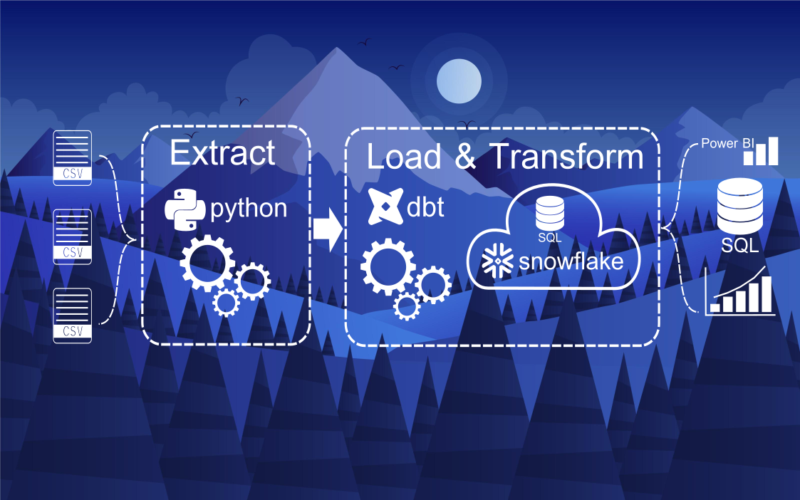
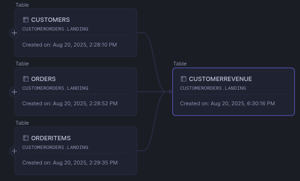

# elt_snowflake_dbt

# *Overview*
Project repo to demonstrate data transformation in Snowflake warehouse, project start with importing CSV file into Snowflake warehouse, setup dbt in local machine to communicate with Snowflake cloud service. DBT is powerful tool to transforming data within warehouse -- Snowflake.  ELT start with exctracting/importing CSV file into Snowflake, Loading process after data source load as database, then Transfroming process using DBT from local machine.
# *Prerequisites*
To follow along this project need to be available on system:
- dbt installed & connection setup with snowflake
  ```bash
  # create virtual environment on local
  python -m venv dbt_snowflake

  # activate created virtual invironment
  cd dbt_snowflake
  source bin/activate

  # install dbt
  pip install dbt-snowflake

  # initialize dbt to connect Snowflake
  dbt init
  ....
  # follow along the query to be filled in
  account: ******
  user: *****
  database: MULYOMART
  warehouse: COMPUTE_WH
  role: ACCOUNTADMIN
  schema: LANDING  
  ....

  # checking dbt connection on Snowflake
  dbt debug
  ```
- snowflake account with warehouse, database
  * warehouse: COMPUTE_WH
  * database: MULYOMART
# *Project Flow*
ELT CSV file into Snowflake using dbt:
1. Import CSV files into Snowfake: customer_data.csv, order_data.csv, order_item_data.csv
   ```bash
   python3 csv_to_snowflake.py
   ```
3. Checking import result by make simple SQL query on Snowflake
   ```SQL
   select c.customer_id, c.full_name, count(o.order_id) as no_of_orders
   from customers c
   join orders o on c.customer_id = o.customer_id
   group by c.customer_id, c.full_name
   order by no_of_orders;
   ```
5. Make sql for data transformation on models folder, ensure remove the other sql
   ```bash
   # create sql file
   vim customerrevenue.sql

   # run dbt
   dbt run
   ```
6. Final data model customerrevenue on LANDING table ready insight generation or data analytics.
   
